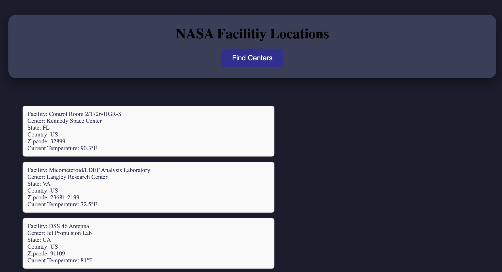

# 🚀 NASA Facility Weather Tracker

A multi-API application that retrieves NASA facility locations and displays detailed location information along with the current weather at each facility.

---

## ✨ About the Project

The **NASA Facility Weather Tracker** was created to combine NASA facility data with real-time weather information.

NASA has hundreds of facilities and locations throughout the United States. This application retrieves NASA facility information and connects that location data to a weather API to provide the **current temperature at the facility**.

The project demonstrates how information returned from one API can be used to make requests to another API.

---

## 🔎 How It Works

1. The application retrieves NASA facility information using the **NASA API**.
2. The API returns NASA facility locations.
3. The application accesses the location information for each facility.
4. That location data is used to retrieve the **current weather** for the facility.
5. The facility and weather information are dynamically displayed on the page.

For each facility, the application can display:

- 🚀 Facility name
- 🏢 NASA center
- 📍 State
- 🌎 Country
- 📮 ZIP code
- 🌡️ Current temperature in Fahrenheit

---

## 🛰️ Connecting Multiple APIs

One of the main goals of this project was learning how to take information returned from one API and use it with another API.

The application first retrieves the NASA facility data and then uses the facility's location to retrieve its current weather.

```text
NASA Facility API
        ↓
Facility Location
        ↓
Location Data
        ↓
Weather API
        ↓
Current Temperature
        ↓
Display Results
```

This allows facility information and current weather data to be displayed together for the user.

---

## 🛠️ Built With

- HTML
- CSS
- JavaScript
- NASA API
- Weather API
- REST APIs
- Fetch API
- DOM Manipulation

---

## 📸 Project Preview



---

## 💡 What I Practiced

This project gave me more experience working with **multiple APIs and larger sets of API data**.

Some of the skills I practiced include:

- Making API requests with `fetch()`
- Working with JSON data
- Accessing nested API data
- Working with large API responses
- Retrieving NASA facility information
- Passing location information between API requests
- Connecting multiple APIs
- Retrieving current weather information
- Working with geographic data
- Dynamically displaying results in the DOM
- Displaying temperature data in Fahrenheit

---

## 🚀 Run the Project

1. Clone the repository:

```bash
git clone https://github.com/smayanja3/complex-nasa-bootcamp.git
```

2. Open the project folder.
3. Open `index.html` in your browser.
4. Explore NASA facilities and view the current weather at each location! 🚀🌎🌡️

Thanks for checking out my project! 🚀🛰️✨
